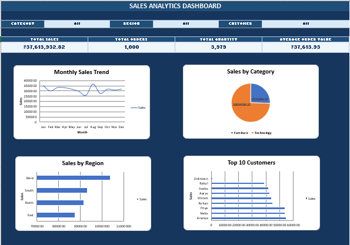

 # Sales Performance Dashboard | Excel

An interactive sales analytics dashboard built in Microsoft Excel to analyze sales performance across products, categories, regions, customers, and time.

The project demonstrates an end-to-end Excel data analysis workflow, including data organization, Pivot Table analysis, interactive filtering, KPI calculations, and dashboard visualization.

---

## 📊 Dashboard Preview



---

## 🎯 Project Objective

The objective of this project is to analyze sales data and identify meaningful business insights related to:

- Overall sales performance
- Order volume and quantity
- Product category performance
- Regional sales performance
- Customer performance
- Monthly sales trends
- Average order value

An interactive Excel dashboard was created to make the analysis easier to understand and explore.

---

## 🛠️ Tools & Technologies

- **Microsoft Excel**
- **Pivot Tables**
- **Pivot Charts**
- **Excel Formulas**
- **SUMIFS**
- **COUNTIFS**
- **Date Functions**
- **Data Cleaning**
- **Data Analysis**
- **Data Visualization**
- **Interactive Dashboard**
- **Filters / Slicers**

---

## 📁 Dataset

The project contains **1,000 sales orders** with information including:

- Order ID
- Order Date
- Customer
- Product
- Category
- Region
- Quantity
- Sales

The data was organized and analyzed in Excel before being transformed into an interactive dashboard.

---

## 📌 Key KPIs

The dashboard tracks four main performance indicators:

| KPI | Value |
|---|---:|
| Total Sales | 37,613,932.82 |
| Total Orders | 1,000 |
| Total Quantity | 3,979 |
| Average Order Value | 37,613.93 |

---

## 📈 Dashboard Features

The interactive dashboard allows users to analyze sales performance using filters for:

- **Category**
- **Region**
- **Customer**

The dashboard dynamically updates the KPIs and analysis based on the selected filters.

### Main Dashboard Metrics

- Total Sales
- Total Orders
- Total Quantity
- Average Order Value

---

## 🔍 Analysis Performed

### 1. Sales by Category

The analysis compares sales generated by different product categories.

| Category | Sales |
|---|---:|
| Technology | 28,034,588.25 |
| Furniture | 9,579,344.57 |

Technology generated the larger share of total sales in the dataset.

---

### 2. Sales by Region

Regional sales were analyzed to identify the strongest-performing regions.

| Region | Sales |
|---|---:|
| East | 8,744,277.34 |
| North | 9,169,887.79 |
| South | 9,321,539.83 |
| West | 10,378,227.86 |

The **West region** generated the highest sales, while the **East region** generated the lowest among the four regions.

---

### 3. Monthly Sales Analysis

Sales were analyzed across all 12 months to identify seasonal patterns and changes in performance.

| Month | Sales |
|---|---:|
| January | 3,511,075.30 |
| February | 2,986,620.15 |
| March | 3,321,371.34 |
| April | 3,311,249.37 |
| May | 3,168,773.93 |
| June | 2,952,237.02 |
| July | 2,548,735.34 |
| August | 3,665,492.13 |
| September | 2,742,406.05 |
| October | 3,161,107.77 |
| November | 3,077,908.82 |
| December | 3,166,955.60 |

**August** recorded the highest monthly sales, while **July** recorded the lowest.

---

### 4. Customer Sales Analysis

Customer-level sales were analyzed to identify high-value customers.

Some of the highest sales contributors included:

| Customer | Sales |
|---|---:|
| Ananya | 5,489,480.80 |
| Neha | 5,386,624.18 |
| Priya | 5,382,946.61 |
| Aarav | 4,288,975.66 |
| Rohan | 4,478,718.60 |
| Vikram | 4,421,428.43 |

This analysis can help identify customers contributing significantly to overall revenue.

---

## 💡 Key Business Insights

The analysis identified several useful business patterns:

- **Technology** is the strongest-performing product category by sales.
- **West** is the highest-performing region by sales.
- **August** recorded the highest monthly sales.
- **July** recorded the lowest monthly sales.
- A relatively small group of customers contributes a significant amount of sales.
- The dashboard allows users to investigate these patterns interactively by category, region, and customer.

---

## 🧮 Excel Techniques Used

The project demonstrates practical Excel skills including:

### Data Analysis

- Data organization
- Data cleaning
- Sorting and filtering
- Aggregation
- KPI calculation
- Trend analysis

### Excel Formulas

- `SUM`
- `SUMIFS`
- `COUNT`
- `COUNTIFS`
- Date functions
- Conditional calculations

### Pivot Tables

Pivot Tables were used to analyze:

- Sales by category
- Sales by region
- Monthly sales
- Customer sales
- Profit analysis

### Dashboard Development

The final dashboard combines:

- KPI cards
- Charts
- Interactive filters
- Pivot-based analysis
- Dynamic calculations

---

## 📂 Project Structure

```text
sales-performance-dashboard-excel/
│
├── README.md
│
├── Excel/
│   └── Sales_Dashboard.xlsx
│
└── Images/
    └── dashboard.png
